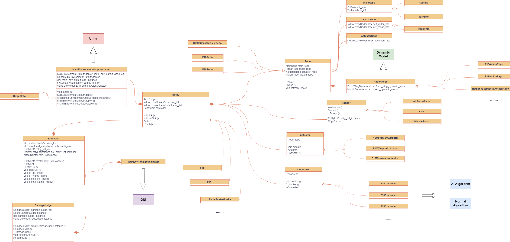

# Main Environment Architecture

Root directory README : ***[ProjectArchitecture](../ProjectArchitecture/ProjectArchitecture.md)***

## Introduction to the Main Environment

The Main Environment is the core module of the whole project. It is constructed by mainly three parts: the Entity Manager, the Dynamic Model and the Damage Judge Module.

The Main Environment shall work within a tick loop. In each tick, the Entities in the Entity Manager recieve the info from the last tick, pick an action based on the dynamic model, and refresh there own info. After that, the Damage Judge Module will judge the damage of each Entity and refresh the Entity Manager. The tick loop will continue until the game ends.

Using a pic to describe the process : 

## Main Environment Structure

And thus based on the process, the Main Environment shall contain these base classes :

- **EntityInitializer** : The Interface for GUI
- **EntityList** : The List that contains all the Entities
- **Entity** : The Base Class for all the Entities
- **DynamicModel** : The Base Class for the Dynamic Model
- **Sensor** : The Base Class for the Sensors
- **Controller** : The Base Class for the Controllers
- **Actuator** : The Base Class for the Actuators
- **Repo** : Repos are the data storage for the Entities
- **DamageJudge** : The Class to Judge the Damage, and the end of the Simulation
- **SimulationManager** : The Class to manage the whole process
- **DataRecorder** : The Class to record the data for the Unity and the AI algorithm

Using the UML to describe the structure :

## Development Log

> ***2023.09.05***

- Finish the *Info.h*, the *Types.h* and the *Info.cpp* with test. Including the `SelfInfo` class, the `TaskInfo` class and the `RadarInfo` class, ***including the test***
- Build the `Repo` class and its components in the *Repo.h*. Including `MainRepo`, `RadarRepo`, `ActuatorRepo`, `ActionRepo`, `RafaleActionRepo`, `Repo`, `RafaleRepo`. The `RafaleActionRepo` is not completed yet because the Dynamic model is not ready. All these ***Including the test***