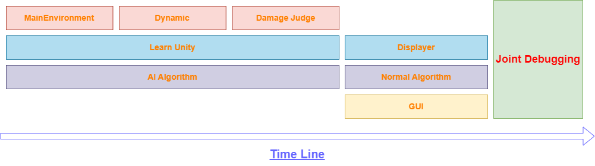

# ProjectArchitecture

## Introduction to the project

This project aims to build an AI training system using alternative AI algorithm to train CGF agents that have extraordinary combat skills in air combat. The combat skills include a variable of aspects, including 1V1 combat skills, cooperation with other agents, cooperation with human controlled airforces etc.

Because the system is aimed to train red side pilots, so the agents will be using mainly US and European aircrafts. We plan to use the Unity platform to build the displaying environment, using Qt creator to create a GUI for the system, and using Pytorch to build the AI algorithm. Plus, we are thinking about using cpp to build the combat environment, dynamic model, and the Damage Judge System.

## A brief design of the project structure

The pic below is the structure of this project, including the name of the modules and the relationship between them.

In the above pic, the GUI module will be constructed with QT, which will work as a initializer for the whole system. The Unity module will be constructed with Unity and C# to display the combat scene. The Combat Environment including the Damage Judge module and the Dynamic module will be constructed with cpp, and at last the algorithms will be constructed with Pytorch or Python.

## The Development Sequence

The development sequence of this project is shown below:

We can see from the above graph that a lot of work can be done in parallel, which will save a lot of time.

## Development documentation

- ***[MainEnvironment](../MainEnvironment/MainEnvironment_README.md)***
- ***[Dynamic](../Dynamic/Dynamic_README.md)***
- ***[Damage Judge](../Damage_Judge/Damage_Judge_README.md)***
- ***[AI Algorithm](../AI_Algorithm/AI_Algorithm_README.md)***
- ***[Normal Algorithm](../Normal_Algorithm/Normal_Algorithm_README.md)***