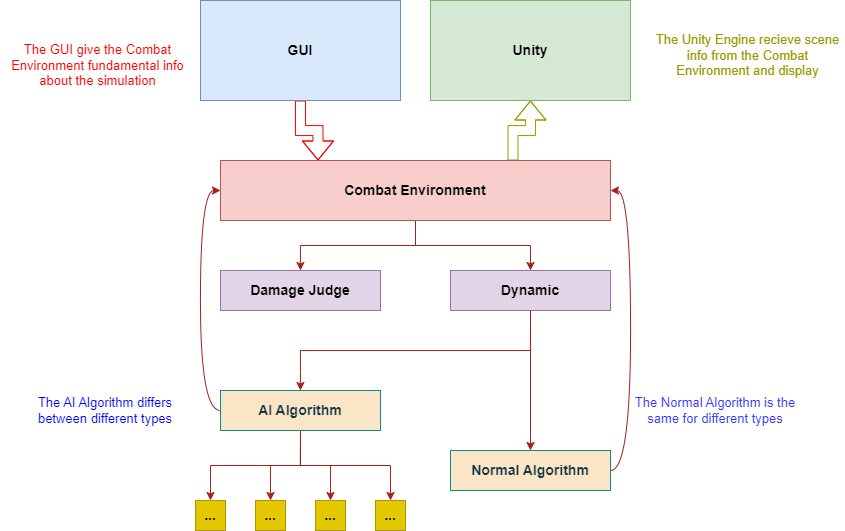

# ProjectArchitecture

## Introduction to the project

This project aims to build an AI training system using alternative AI algorithm to train CGF agents that have extraordinary combat skills in air combat. The combat skills include a variable of aspects, including 1V1 combat skills, cooperation with other agents, cooperation with human controlled airforces etc.

Because the system is aimed to train red side pilots, so the agents will be using mainly US and European aircrafts. We plan to use the Unity platform to build the displaying environment, using Qt creator to create a GUI for the system, and using Pytorch to build the AI algorithm. Plus, we are thinking about using cpp to build the combat environment, dynamic model, and the Damage Judge System.

## A brief design of the project structure

The pic below is the structure of this project, including the name of the modules and the relationship between them.

